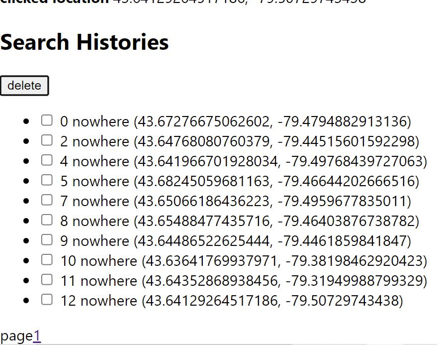

#The Map front-end project

This project was bootstrapped with [Create React App](https://github.com/facebook/create-react-app).

## Available Scripts

In the project directory, you can run:`npm start`

Runs the app in the development mode.\
Open [http://localhost:3000](http://localhost:3000) to view it in your browser.

##Description
###1. get location and searching

click the get location, show the current location and the exact value. 

entering and searching for the place.

 Due to the problem of CORS, it cannot search successfully. 

###2. history and delete
When clicking the map, it can shows the location of this point, and add this record to the history list. 

Ten records  are shown in one page, the page can be changed by clicking the number of page. 

There is a checkbox before each record. Users can select multiple records. 

Clicking the delete button, the record can be deleted successfully. 

